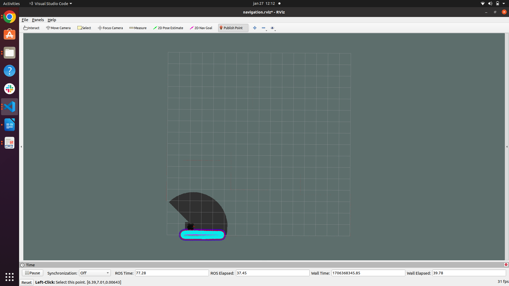

# acs_route_planning

This package contains an implementation of Ant Colony System for Path Planning

## Dependencies

- [tuw_multi_robot](http://wiki.ros.org/tuw_multi_robot)
- [map2gazebo](https://github.com/shilohc/map2gazebo)

### Load simulation in Gazebo

It is necessary to use the package [map2gazebo](https://github.com/shilohc/map2gazebo) to generate a world compatible with the gazebo, using a png of the map you want to simulate. The available maps are in [tuw_multi_robot](http://wiki.ros.org/tuw_multi_robot) package. See both documentations.

```bash
roslaunch acs_route_planning  world.launch map:=map_name.world room:=room_name
```
Ex:
```bash
roslaunch acs_route_planning  world.launch room:=cave
```

<h1 align="center">
  
</h4>

After roslaunch ACS, the rviz and the gazebo simulation enviroment will be opened, use the Publish Point button to choose the robot’s target:

<h1 align="center">
  
</h4>

When ACS algorithm find the path, the robot starts the path execution.

<h1 align="center">
  
</h4>
