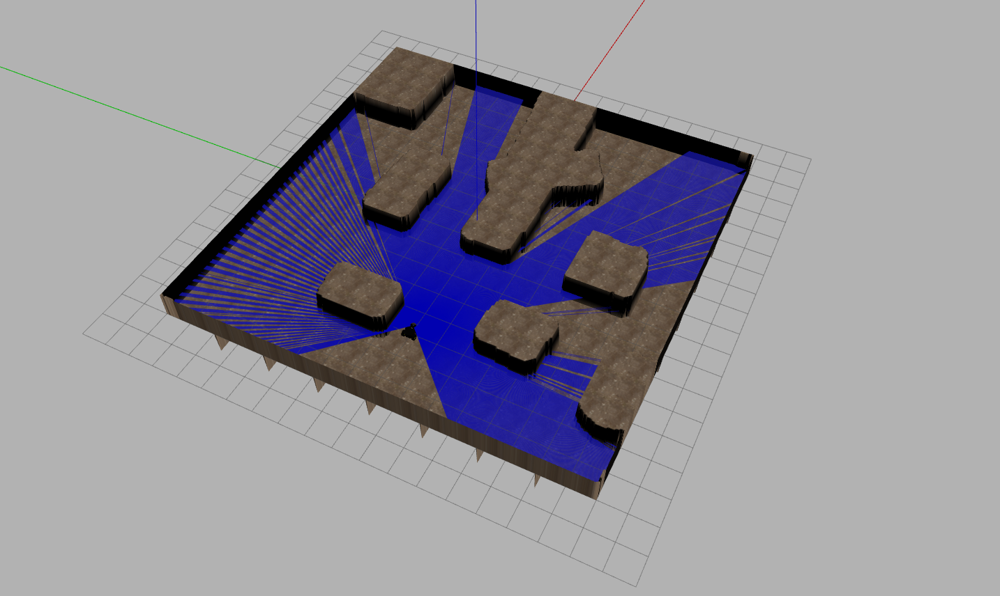

# acs_route_planning

## Dependencies

- [tuw_multi_robot](http://wiki.ros.org/tuw_multi_robot)
- [heightmap_generation](https://github.com/blackcoffeerobotics/heightmap_generation)

## Testing

### Generate maps for tests

```bash
python3 scripts/map_creator/generate_maps.py 
```

### Run tests for ACS algorithm

```bash
./tests/test_acs.sh
```
### Launch ACS route planning

```bash
roslaunch acs_route_planning  load_graph.launch room:=room_name
```

After roslaunch, you have to publish two points to run the ACS: the start point and the end point for the robot

<h4 align="center">
  
</h4>

### Load simulation in Gazebo

```bash
roslaunch acs_route_planning  world.launch world:=world_name
```
<h4 align="center">
  
</h4>


